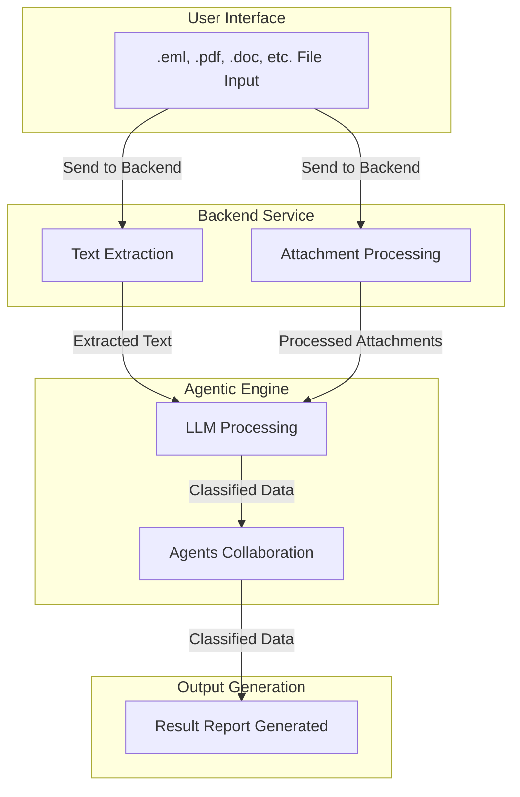

# 🚀 Gen AI Orchestrator for Email and Document Triage/Routing by TecHunters

## 📌 Table of Contents
- [Introduction](-introduction)
- [Demo](-demo)
- [Inspiration](-inspiration)
- [What It Does](-what-it-does)
- [How We Built It](-how-we-built-it)
- [Challenges We Faced](-challenges-we-faced)
- [How to Run](-how-to-run)
- [Tech Stack](-tech-stack)
- [Team](-team)

---

## 🎯 Introduction
This project focuses on automating email classification using Generative AI and LLMs to interpret and process emails and attachments. The solution is designed for consumer loans and bank lending services, ensuring accurate categorization of requests, prioritization, and duplicate detection.

It aims to solve challenges related to manual email classification, overlapping request types, and duplicate detection, making it easier for financial institutions to manage email-based queries efficiently.

## 🎥 Demo
🔗 [Live Demo](https://drive.google.com/file/d/1pE0wioNv1XMJX4X-9Wog99GZgAaK0k0f/view)   
📹 [Video Demo](https://drive.google.com/file/d/1pE0wioNv1XMJX4X-9Wog99GZgAaK0k0f/view) 

## 💡 Inspiration
The project was inspired by the inefficiencies in manual email classification and the need for a scalable AI-driven solution. Banking and lending services handle large volumes of customer emails daily, making automation critical for faster response times and improved customer satisfaction.

We wanted to leverage LLMs, CrewAI, and other AI-driven tools to streamline the process, reduce human intervention, and improve accuracy in classifying and prioritizing emails.

## ⚙️ What It Does
The project performs the following key functions:
Processes EML files by extracting the email body and attachment text.
Classifies requests and sub-requests using Generative AI.
Assigns priority levels to classified emails.
Detects duplicate emails based on content similarity.
Calculates confidence scores for classification results.
Identifies overlapping request types and displays overlap percentage.
Provides a React-based UI for user interaction and monitoring.
Uses a Flask backend powered by CrewAI for LLM-driven classification.
Generates JSON-formatted reports, summarizing classification insights.

## 🛠️ How We Built It
React for an interactive user interface.
Flask for the backend API and data processing.
CrewAI for AI agent task orchestration.
Hugging Face models & DeepSeek for NLP-based classification.
LangChain for enhanced LLM interactions.

## 🚧 Challenges We Faced
Ensuring accurate classification when email bodies contain ambiguous content.
Balancing processing speed and AI model complexity to maintain efficiency.
Extracting meaningful content from attachments while prioritizing email body text.
Fine-tuning duplicate detection to avoid false positives.
Managing overlapping request types effectively in reports.
Integrating CrewAI with Flask for seamless LLM-driven classification.
Optimizing the React UI for smooth user experience and real-time insights.

## System Architecture Diagram



## 🏃 How to Run
1. Clone the repository  
   ```sh
   git clone https://github.com/ewfx/gaied-tec-hunters.git
   ```
2. Install dependencies  
   ```sh
   npm install
   pip install -r requirements.txt (for Python)
   ```
3. Run the project  
   ```sh
   npm start
   python app.py
   ```

## 🏗️ Tech Stack
- 🔹 Frontend: React
- 🔹 Backend: Flask (Python)
- 🔹 AI & NLP: CrewAI

## 👥 Team
- **Alok Kumar Singh** - [GitHub](https://github.com/harmonicfunc) | [LinkedIn](https://www.linkedin.com/in/alok--d95/)
- **Anvit Pawar** - [GitHub](https://github.com/anvitpawar) | [LinkedIn](https://www.linkedin.com/in/anvit-pawar-b7602aba/)
- **Ayush Kumar** - [GitHub](https://github.com/Ayush-Kumar0) | [LinkedIn](https://www.linkedin.com/in/ayushkumar953248/)
- **Yashasvi Singh** - [GitHub](https://github.com/yashasvisingh1) | [LinkedIn](https://www.linkedin.com/in/yashasvi7/)
- **Guruvulu Avula** - [LinkedIn](https://www.linkedin.com/in/guruvulu-avula-6273baa1/)
